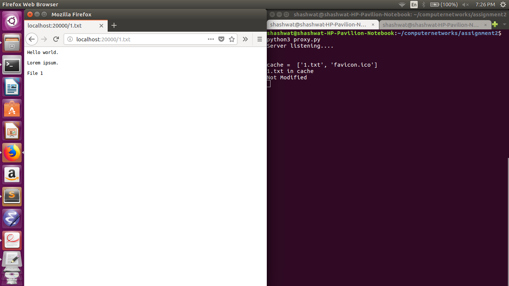

# Proxy-Server

## Features:
- Proxy Server
- Caching with a size upto 3 files.
- If-Modified-Since Header also incorporated

## Instructions:
- Go to the directory containing proxy.py
- Open server directory in a new terminal tab
- Run 'python server.py' on the terminal in the server folder.
- Next, run 'python3 proxy.py' on another terminal in the folder containing proxy.py
- Open firefox and set proxy to localhost and port to 12345
- Type 'http://localhost:20000' in the url.
- Select the file you want

